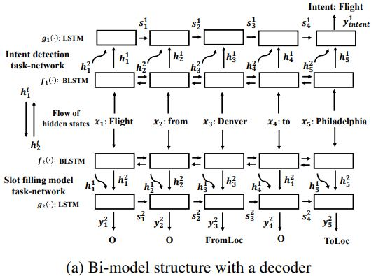

# Bi-Model-Intent-And-Slot

Pytorch implementation of paper ["A Bi-model based RNN Semantic Frame Parsing Model for Intent
Detection and Slot Filling".](https://www.aclweb.org/anthology/N18-2050)

We only build the model with decoder. 



We do not tune the hyper-parameters carefully as it is so boring. Obtaining best result of **intent accuracy** is 0.9843 and f1 score of **slot filling** is 0.9563 when model runs a lot of epoch(need some lucky), but still lower than the claimed result of that paper(0.9899, 0.9689).

| ---       | Intent acc | Slot filling F1 |
| --------- | ---------- | --------------- |
| paper     | 0.9899     | 0.9689          |
| reproduce | 0.9843     | 0.9600          |

### Setup

Pytorch>=0.4.0, python3.

```bash
python train.py
```


### Reference 

1. [Dataset and codes calculator F1 score from here.](https://github.com/sz128/slot_filling_and_intent_detection_of_SLU)

2. [Tricks of dealing with atis dataset from here.](https://github.com/HadoopIt/rnn-nlu/issues/9)

   
